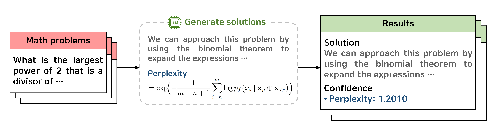

# Perplexity-based-Confidence-Scoring
생성형AI 모델의 Perplexity를 기반으로 생성 결과에 대한 대표적인 평가 요소인 ‘신뢰도’ 측정 기법

## 💡 예시


## ⚙️ Requirements
To install requirements:
```
pip install -r requirements.txt
```

## 💻 Usage Guide
perplexity를 측정할 수학 문제 데이터셋을 준비합니다.

- `dataset_name`: REF / TEST / AMC / AIME / AHSME
- `model_name`: Mathstral-7B / Deepseek-math-7b-rl / Qwen-2.5-math-7B / OpenMath2-Llama3.1-8B / OREAL-7B

### Step 1. Generation & Step 2. Feature Extraction

```
python src/generation_and_feature_extraction.py --model_name "generation_model_name" --n_generation 20 --dataset_name REF
python src/generation_and_feature_extraction.py --model_name "generation_model_name" --n_generation 3 --dataset_name TEST
```

## 🧪 예시
아래는 perplxtiry가 계산되어 저장된 최종 결과물 예시 `{output}/{dataset_name}/{model_name}.json` 입니다.

```
{
    "competition_id": "2016_AMC_8_Problems",
    "problem_id": 1,
    "k": 1,
    "n": 4,
    "idx": 1,
    "response": "Solution 2:\nWe can approach this problem by ... {생략}",
    "perplexity": 1.2158113718032837
},
```

## 🧠 작동 원리
1️⃣ **토큰 생성 및 모델 출력 획득**  
모델이 `generate()` 함수를 통해 새로운 토큰을 생성합니다.  
이때 `return_dict_in_generate=True`, `output_scores=True` 옵션을 사용하여  
생성 과정의 내부 확률 정보와 어텐션을 함께 반환받습니다.

2️⃣ **프롬프트와 생성 구간 분리**  
모델 입력(`input_ids`)의 길이를 기준으로  
프롬프트 구간과 생성된 토큰 구간(`generated_ids`)을 분리합니다.  
이렇게 하면 프롬프트 이후에 모델이 실제로 생성한 텍스트 부분만을 분석할 수 있습니다.

3️⃣ **로그 확률(log probability) 계산**  
생성된 각 토큰에 대해,  
이전 시점의 로짓(`logits`)을 `Softmax`로 변환해 확률 분포를 얻습니다.  
그중 실제 생성된 토큰의 확률을 선택하고 로그를 취해 `log_prob`로 저장합니다.  
즉,  $\text{log}\textunderscore\text{prob}=\log P(t_i | t_{<i})$

4️⃣ **Perplexity 계산**  
모든 생성 토큰의 평균 로그 확률을 계산한 뒤, 이를 음수로 바꿔 지수화하여 perplexity를 구합니다.  

$\text{Perplexity}=\exp\Big({-\frac{1}{N}}\sum_{i=1}^N \log P(t_i | t_{<i})\Big)$

Perplexity가 낮을수록 모델이 자신의 생성에 대해 높은 확신을 가진다는 의미입니다.

💡 **장점:**  
- 토큰 단위 확률을 직접 계산하므로, **모델의 불확실성을 정량적으로 평가**할 수 있습니다.  
- 라벨이 없는 상황에서도 **샘플 난이도나 모델 신뢰도 비교**에 활용 가능합니다.  
- 생성 모델의 품질을 평가하는 **객관적 지표**로 사용하기 적합합니다.
